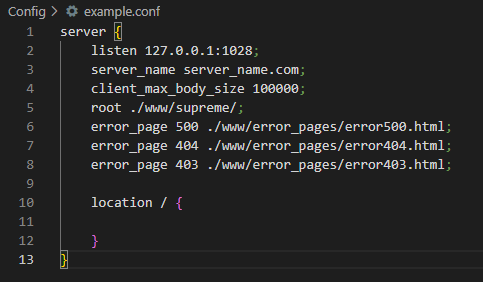
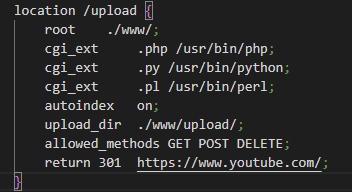

# WebServ

# Introdução
O projeto propõe a criação de um servidor web, com um  funcionamento parecido com o nginx. O programa deve lidar com requisições de clientes, com os métodos GET, POST e DELETE, deve aceitar o upload de arquivos e executar CGIs em alguma linguagem que não necessariamente c++.
# 
# HTTP

## Como funciona um servidor HTTP

## Primeiro, o que é HTTP?
HTTP é um protocolo de transferência que possibilita que as pessoas que inserem a URL do seu site na Web possam ver os conteúdos e dados que nele existem. A sigla vem do inglês Hypertext Transfer Protocol.

Esse sistema é a base da comunicação que existe em toda a internet em que os sites e conteúdos tragam hiperlinks possam ser encontrado mais facilmente pelo publico.

## O funcionamento

HTTP é um protocolo baseado em texto sem conexão. Isso significa que as pessoas que acessam o site da sua empresa enviam solicitações a servidores que exibem em formato de texto, imagens e outros tipos de mídia. Depois que a solicitação é atenddida pelo servidor, a conexão entre o clente e servidor é fechada.

Cada solicitação necessita de uma nova conexão, então cada vez que alguém acessa seu site, o servidor recebe uma nova conexão com uma nova solicitação.

### O que acontece por baixo dos panos:
O navegador se conecta ao servidor e envia uma solicitação HTTP para a pagina desejada. Então, com essa solicitação ja dentro do servidor, ele verifica se aquela pagina existe dentro dele, se é permitido enviar aquela informação, se todo o corpo da requisição está correto, e caso alguma coisa falhe, uma pagina de erro é retornada ao navegador. Após o navegador receber uma resposta do servidor,ele traduz todo aquele texto recebido para a pagina que vemos e fecha a conexão com o servidor.
#
# Sobre o projeto
Esse projeto foi configurado para aceitar essas requisições, e a execução de CGIs está limitada a python e perl. Os arquivos de configuração do servido é bem parecido com o do nginx, com algumas limitacões, claro.
Um exemplo de como criar um arquivo de configuração valido esta aqui(colocar o redirect).

## O funcionamento
O servidor primeiro é configurado com base em um arquivo `.conf`, que tem o ip, porta e as rotas que aquele endereço tem acesso dentro dos arquivos do servidor. Nesse arquivo também contém as paginas de erro, a raiz do site e o tamanho maximo do body size que o cliente pode enviar. No mesmo arquivo de configuração pode existir mais de uma configuração para sites, a única observação quanto a isso é garantir que as portas usadas entre eles são diferentes.

Após lido o arquivo de configuração, caso nao tenha nenhum erro, é criado os sockets, que são por onde cliente e servidor irao se comunicar. Durante a criação dos sockets, é verificado se as portas configuradas para cada url está disponivel para o Bind(), que pode estar sendo usada em algum outro processo. 
Com essas verificações feitas, os sites ficam disponiveis para os clientes, aguardando que alguma conexão ocorra.

Quando alguma conexão ocorre, o servidor aceita a conexão e gera um fd para o client, logo após, verifica oq foi pedido, se oq foi pedido é acessavel dentro do sistema, e com isso, monta a resposta que sera enviada ao cliente.

O servidor pode receber requisições do tipo GET, POST e DELETE.

### GET:
- Uma simples solicitação de uma página estática, um arquivo, uma lista do que tem no diretório, etc.

### POST:
- Pode ser usado para subir um arquivo ao servidor, o que irá resultar numa requisição multipart. Uma explicação melhor sobre o funcionamento do multipart se encontra [aqui](https://pt.stackoverflow.com/questions/418026/multipart-formdata-é-uma-estrutura-de-dados).

### DELETE:
- ira deletar um arquivo, caso permitido pelas configurações. Esse, por enquanto, só é possivel via Postman, ThunderClient ou algo do tipo.

#
# Como criar um arquivo de configuração
Assim como no nginx, as configurações sao ordenadas por blocos, mais especificamente bloco de `server{}` e de `location {}`
### server {} :

Esse bloco contém informações basicados dos servidor como:
- 	listen: Ip e Porta que irão ser liberados para o acesso dos clientes.
-	server_name: um apelido para o url do site.
-	client_max_body_size: tamanho maximo de uma requisição.
-	root: raiz do site que será hospedado.
-	error_page: a configuração das paginas de erro. Deve ter o valor e o caminho do arquivo.
-	location{}: os blocos de rotas daquele site.

Exemplo:

#
### location /$rota {} :

Esse bloco contém a configuração das rotas, e pode conter itens como:
-	$rota: o caminho que será acessado.
-	root: a raiz para aquele diretório, pode ser diferente do root do server.
-	cgi_ext: libera a execução de uma cgi, deve ter o tipo da cgi e o programa que deve executar.
-	autoindex: faz uma listagem do diretorio caso seja enviado com a opção ``on``. Por padrão, está com `off`.
-	upload_dir: o diretorio que serão armazenados os arquivos que o cliente queira subir.
-	allowed_methods: os metodos permitidos naquela location.
-	return: lidará com redirecionamentos. Deve conter o código desejado e a url de destino.

Exemplo:

	
#
Um detalhe importante é: todas as linhas devem terminar com `;`, caso alguma linha esteja inválida, o sistema irá recomendar que conserte, e nao irá iniciar até que o erro seja resolvido.

